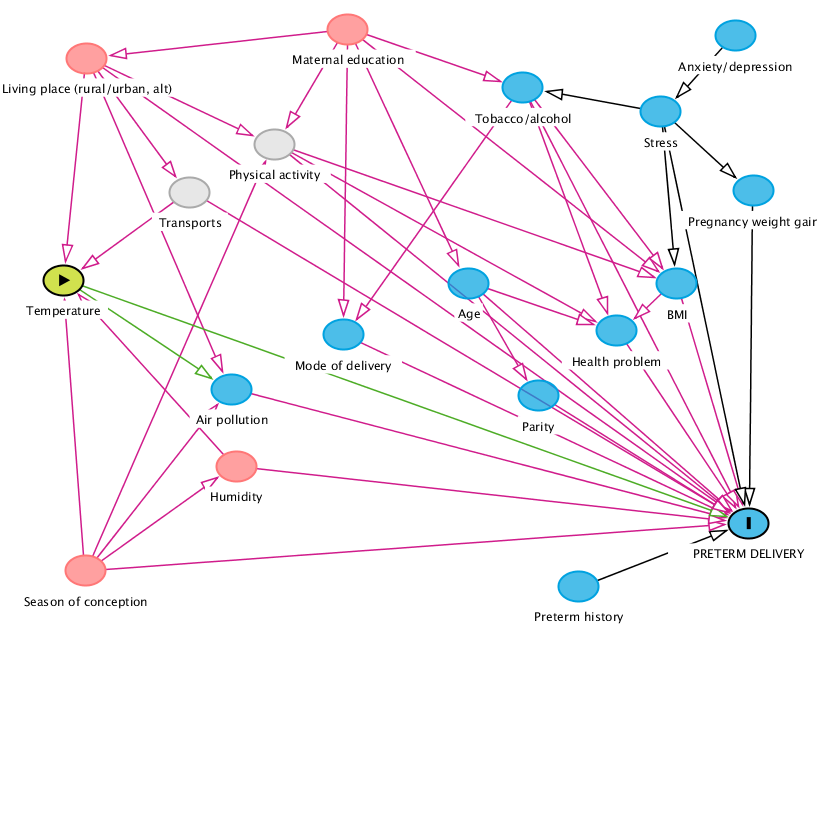

<!-- ## 22-11-2019 meeting agenda & docs

Here are the different documents for the 22-11-19 meeting.

### 1. Sepages data

#### Imputation below LOD

* Previous doc justifying the fill-in method (no need to review): [imputation_below_lod_2019-11-20](docs/imputation_below_lod_2019-11-20.html)
* Validation of the fill-in method: [fill_in_vs_machine_reading_2019-11-20](docs/fill_in_vs_machine_reading_2019-11-20.html)

#### Correction for protocol variables

* phenols: [protocol_variables_vs_phenols_2019-11-20](docs/protocol_variables_vs_phenols_2019-11-20.html)
* phthalates: [protocol_variables_vs_phthalates_2019-11-20](docs/protocol_variables_vs_phthalates_2019-11-20.html)

### 2. BPA/BPS VS Growth 

* Variable coding document update: [variable_coding_2019-11-20](docs/variable_coding_2019-11-20.html)
* Preliminary results: [multivariate_model_2019-11-20](docs/multivariate_model_2019-11-20.html) 

# BPA/BPS growth - 12/12/19 meeting

Last version of multivariate models: [multivariate_model_2019-12-11](docs/multivariate_model_2019-12-11.html) -->

# Meeting Climathes 26/06/2020

## 1. Last version of the DAG

* Parity -> gest age?
* Pollution / humidity -> gest age?

## 2. Cohort comparison

[cohort_comparison_2020-06-25](docs/cohort_comparison_2020-06-25.html)

## 3. Temperature exposure description 

* Confirm we just use the `*_gro` files

[description_expos_2020-06-25](docs/description_expos_2020-06-25.html)

## 4. To do

* continue exposure description (what?)
* finalise Sepages variables (check notes from previous meeting with Johanna: marital status, country of birth etc)
* write to pelagie with the list of questions (cf. project log + [github note](https://github.com/users/matthieugold/projects/16))
* look at humidity, pollution, location (urbain/rural) 
* write analysis plan
  * define what indicators for temperature?
* do some methods bibliography

