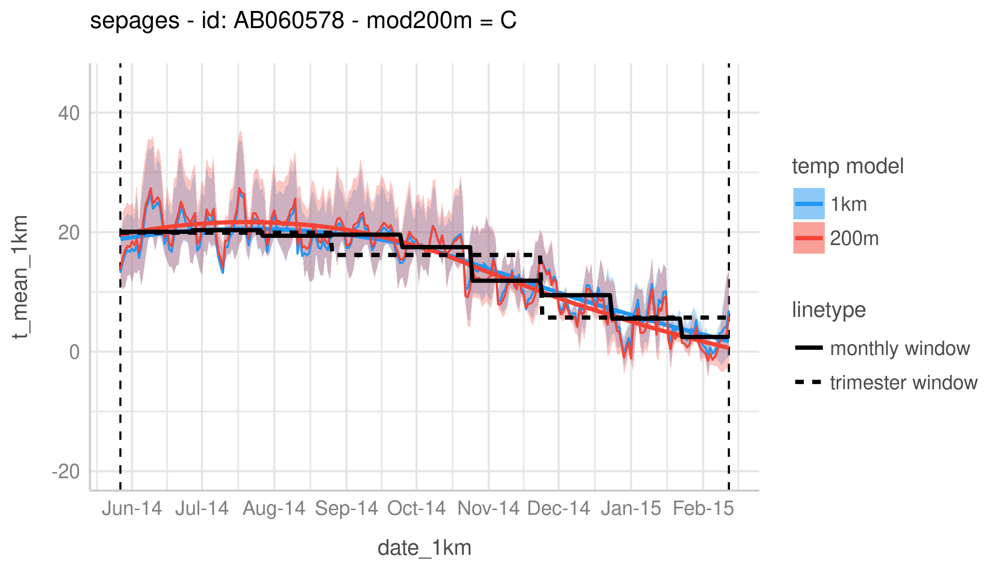

<!-- ## 22-11-2019 meeting agenda & docs

Here are the different documents for the 22-11-19 meeting.

### 1. Sepages data

#### Imputation below LOD

* Previous doc justifying the fill-in method (no need to review): [imputation_below_lod_2019-11-20](docs/imputation_below_lod_2019-11-20.html)
* Validation of the fill-in method: [fill_in_vs_machine_reading_2019-11-20](docs/fill_in_vs_machine_reading_2019-11-20.html)

#### Correction for protocol variables

* phenols: [protocol_variables_vs_phenols_2019-11-20](docs/protocol_variables_vs_phenols_2019-11-20.html)
* phthalates: [protocol_variables_vs_phthalates_2019-11-20](docs/protocol_variables_vs_phthalates_2019-11-20.html)

### 2. BPA/BPS VS Growth 

* Variable coding document update: [variable_coding_2019-11-20](docs/variable_coding_2019-11-20.html)
* Preliminary results: [multivariate_model_2019-11-20](docs/multivariate_model_2019-11-20.html) 

# BPA/BPS growth - 12/12/19 meeting

Last version of multivariate models: [multivariate_model_2019-12-11](docs/multivariate_model_2019-12-11.html) -->

# Meeting Climathes 07/07/2020

## 1. Add Sepages to continuous data description

[description_temperature_2020_07_07](docs/description_temperature_2020_07_07.html)

## 2. Windows data description

[eden_windows_description_2020_07_07](docs/eden_windows_description_2020_07_07.html)
[pelagie_windows_description_2020_07_07](pelagie_windows_description_2020_07_07.html)
[sepages_windows_description_2020_07_07](docs/sepages_windows_description_2020_07_07.html)

## 3. Pelagie: checking for pregnancy data in Pelagie Q2 and Q6

[check_for_preg_data_in_q2_q6_2020_07_07](check_for_preg_data_in_q2_q6_2020_07_07.html)

## 4. Biblio

[notes_biblio_2020_07_07](notes_biblio_2020_07_07.html)

## 5. To do/questions

* continue exposure description (what?)
* finalise Sepages variables (check notes from previous meeting with Johanna: marital status, country of birth etc)
* write to pelagie with the list of questions (cf. project log + [github note](https://github.com/users/matthieugold/projects/16))
* look at humidity, pollution, location (urbain/rural) 
* write analysis plan
  * define what indicators for temperature?
* do some methods bibliography

* Finalise model vars with final DAG
* why PTB y/n and not gestation duration continuous? 
* quel est l'interet de notre analyse par rapport aux nombreuses autres similaires? (population francaise, modèles de température plus précis, cohort data: individual level data (!= population level data), ajustement sur de nbreux facteurs)
* pollution?
* will we need the windows? as dlnm can handle continuous time series
* interessant d'utiliser l'expo pré conception? ([@guo_association_2018])
* c'est quoi la référence temporelle? LMP ou date of birth? ie on regarde la température en jours avant la naissance ou en jours depuis le LMP?
* pk focaliser sur température et pas température/pollution/ndvi? qi on met les 3 ds le modèle

Timing:

* finish var table doc
* write analysis plan

